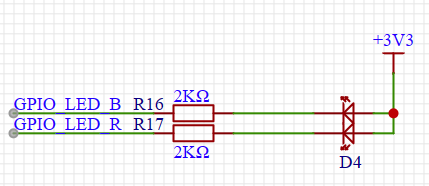
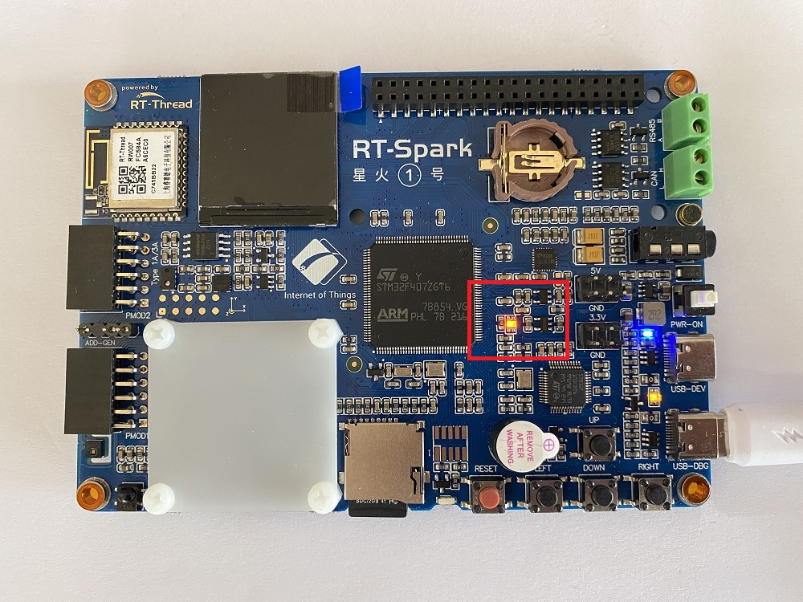

# RGB LED 例程

## 简介

本例程主要功能是让板载的 RGB-LED 灯周期性地变换颜色。

## 硬件说明




如上图所示， RGB-LED 属于共阳 LED ， 阴极分别与单片机的引脚连接，其中红色 LED 对应 PF12 号引脚，蓝色 LED 对应 PF11 号引脚。单片机对应的引脚输出低电平即可点亮对应的 LED ，输出高电平则会熄灭对应的 LED。

RGB-LED 在开发板中的位置如下图所示：


## 软件说明

RGB-LED 对应的单片机引脚定义可以通过查阅头文件 `/drivers/drv_gpio.h` 获知。

```c
/* 配置 LED 灯引脚 */
#define PIN_LED_B              GET_PIN(F, 11)      // PF11 :  LED_B        --> LED
#define PIN_LED_R              GET_PIN(F, 12)      // PF12 :  LED_R        --> LED
```

RGB-LED 灯变换的源代码位于 /examples/02_basic_rgb_led/applications/main.c 中。

```c
int main(void)
{
    unsigned int count = 0;
    unsigned int group_num = sizeof(_blink_tab)/sizeof(_blink_tab[0]);
    unsigned int group_current;

    /* 设置 RGB 灯引脚为输出模式 */
    rt_pin_mode(PIN_LED_R, PIN_MODE_OUTPUT);
    rt_pin_mode(PIN_LED_B, PIN_MODE_OUTPUT);
    rt_pin_write(PIN_LED_R, LED_OFF);
    rt_pin_write(PIN_LED_B, LED_OFF);

    do
    {

        /* 获得组编号 */
        group_current = count % group_num;

        /* 控制 RGB 灯 */
        rt_pin_write(PIN_LED_R, _blink_tab[group_current][0]);
        rt_pin_write(PIN_LED_B, _blink_tab[group_current][1]);

        /* 输出 LOG 信息 */
        LOG_D("group: %d | red led [%-3.3s] | | blue led [%-3.3s]",
            group_current,
            _blink_tab[group_current][0] == LED_ON ? "ON" : "OFF",
            _blink_tab[group_current][1] == LED_ON ? "ON" : "OFF");

        count++;

        /* 延时一段时间 */
        rt_thread_mdelay(500);
    } while ( count > 0 );
    return 0;
}
```

## 运行
### 编译 & 下载

- RT-Thread Studio：通过RT-Thread Studio导入工程，执行编译。
- MDK：首先双击 mklinks.bat，生成 rt-thread 与 libraries 文件夹链接；再使用 Env 生成 MDK5 工程；最后双击 project.uvprojx 打开 MDK5 工程，执行编译。

编译完成后，将开发板的 ST-Link USB 口与 PC 机连接，然后将固件下载至开发板。

### 运行效果

按下复位按键重启开发板，观察开发板上 RBG-LED 的实际效果。正常运行后， RGB 会周期性变化，如下图所示：




此时也可以在 PC 端使用终端工具打开开发板的 ST-Link 提供的虚拟串口，设置 115200 8 1 N 。开发板的运行日志信息即可实时输出出来。

```
[D/main] group: 0 | red led [ON ] | | blue led [ON ]
[D/main] group: 1 | red led [OFF] | | blue led [ON ]
[D/main] group: 2 | red led [ON ] | | blue led [OFF]
[D/main] group: 3 | red led [ON ] | | blue led [ON ]
[D/main] group: 4 | red led [OFF] | | blue led [OFF]
[D/main] group: 5 | red led [ON ] | | blue led [OFF]
[D/main] group: 6 | red led [OFF] | | blue led [ON ]
[D/main] group: 7 | red led [OFF] | | blue led [OFF]
[D/main] group: 0 | red led [ON ] | | blue led [ON ]
[D/main] group: 1 | red led [OFF] | | blue led [ON ]
[D/main] group: 2 | red led [ON ] | | blue led [OFF]
[D/main] group: 3 | red led [ON ] | | blue led [ON ]
[D/main] group: 4 | red led [OFF] | | blue led [OFF]
[D/main] group: 5 | red led [ON ] | | blue led [OFF]
[D/main] group: 6 | red led [OFF] | | blue led [ON ]
[D/main] group: 7 | red led [OFF] | | blue led [OFF]

```

## 注意事项

暂无

## 引用参考

- 设备与驱动：[PIN 设备](https://www.rt-thread.org/document/site/#/rt-thread-version/rt-thread-standard/programming-manual/device/pin/pin)
